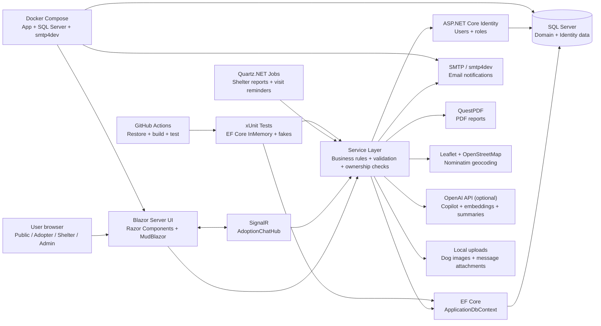
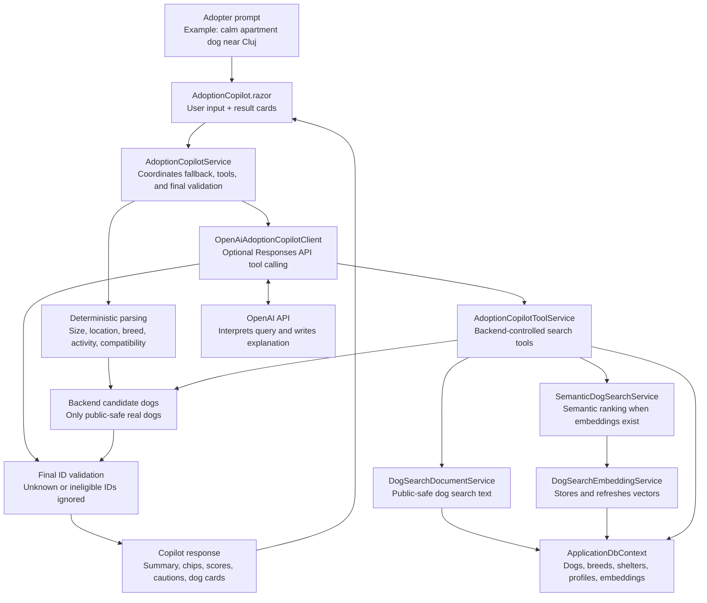

# PawConnect

A full-stack ASP.NET Core Blazor Server platform for stray dog adoption and shelter management.


PawConnect is a multi-role web application that connects adopters with animal shelters and supports the adoption process from public dog discovery to request review, visit confirmation, messaging, reporting, and shelter operations. It is built as a portfolio-ready ASP.NET Core project with role-based workflows, service-layer business rules, SQL Server persistence, maps, notifications, reports, automated tests, Docker support, and optional OpenAI-assisted discovery features.

## Table of Contents

- [Features](#features)
- [Tech Stack](#tech-stack)
- [Architecture Overview](#architecture-overview)
- [User Roles](#user-roles)
- [Main Workflows](#main-workflows)
- [Screenshots](#screenshots)
- [Getting Started](#getting-started)
- [Configuration](#configuration)
- [Deployment Preparation](#deployment-preparation)
- [Running with Docker](#running-with-docker)
- [Running Tests](#running-tests)
- [Continuous Integration](#continuous-integration)
- [API Documentation](#api-documentation)
- [Project Structure](#project-structure)
- [Security and Privacy Notes](#security-and-privacy-notes)
- [Future Work](#future-work)
- [CV Summary](#cv-summary)

## Features

### Public discovery

- Browse public-safe dogs at `/dogs`.
- View dog details, medical/food context, shelter information, breed information, image gallery, and lightbox preview at `/dogs/{id:int}`.
- Browse shelters and public shelter details at `/shelters` and `/shelters/{id:int}`.
- View adoption success stories at `/success-stories`.
- Browse approved Lost & Found posts at `/lost-found`.
- Submit shelter applications through `/shelters/apply`.
- View shelter locations with Leaflet and OpenStreetMap when coordinates are available.

### Adopter

- Manage adopter profile at `/adopter/profile`.
- View adopter dashboard at `/adopter/dashboard`.
- Save favorite dogs and view favorites at `/favorites`.
- Track recently viewed dogs.
- View personalized recommendations at `/adopter/recommendations`.
- Use Adoption Copilot natural-language dog search at `/adopter/copilot`.
- Submit, track, and cancel adoption requests at `/my-adoption-requests`.
- Message shelters inside adoption-request conversations.
- View notifications and notification preferences.

### Shelter

- View shelter dashboard and operational summaries at `/shelter/dashboard`.
- Manage owned dogs at `/shelter/dogs`, including create/edit pages, breed lookup, images, medical records, status history, and dog profile quality feedback.
- Review adoption requests at `/shelter/adoption-requests`.
- Confirm visits, reject requests, and finalize adoptions through the adoption workflow.
- Manage adoption pipeline at `/shelter/adoption-pipeline`.
- Configure visit availability at `/shelter/availability`.
- Manage resources and low-stock thresholds at `/shelter/resources`.
- Use shelter analytics at `/shelter/analytics`.
- Use shelter operations assistant and natural-language operational search at `/shelter/assistant` and `/shelter/search`.
- Export shelter-scoped data and import CSV data where supported.
- Message adopters in adoption-request conversations.

### Admin

- View admin dashboard at `/admin/dashboard`.
- Manage users, shelters, dogs, and adoption requests.
- Review shelter applications at `/admin/shelter-requests`.
- Moderate Lost & Found posts at `/admin/lost-found`.
- Review message reports at `/admin/message-reports`.
- View platform analytics at `/admin/analytics`.
- Review report history, activity/audit logs, and notification delivery logs.
- Rebuild and inspect the dog search index at `/admin/search-index`.
- Evaluate Adoption Copilot results at `/admin/copilot-evaluation`.
- Use admin natural-language search at `/admin/search`.

### AI and search

- Adoption Copilot uses natural-language prompts to find real PawConnect dogs.
- Copilot combines deterministic parsing, public-safe filters, semantic search when embeddings are available, and optional OpenAI Responses API tool calling.
- OpenAI is optional and is not treated as the source of truth. PawConnect validates final dog IDs against real backend candidates before display.
- Recommended Dogs uses rule-based scoring with optional OpenAI explanation/reranking of backend-provided candidates.
- Dog search documents and `DogSearchEmbedding` records support semantic search when OpenAI embeddings are configured.
- Natural-language operational search exists for Admin and Shelter workflows.
- AI-generated summaries and profile quality checks are implemented behind service abstractions and fall back safely when OpenAI is disabled or unavailable.

### Infrastructure and quality

- ASP.NET Core Identity roles for Public, Adopter, Shelter, and Admin workflows.
- EF Core migrations and SQL Server persistence.
- xUnit automated tests with EF Core InMemory and fake services.
- GitHub Actions CI for restore, build, and test.
- Docker Compose setup for the app, SQL Server, and smtp4dev.
- MailKit SMTP email sending with local smtp4dev support.
- QuestPDF report generation.
- Quartz.NET scheduled jobs for shelter summaries and visit reminders.
- CSV import/export and PDF/CSV report history.
- SignalR messaging for adoption-request conversations.

## Tech Stack

| Area | Technology | Purpose |
| ---- | ---------- | ------- |
| Backend/UI | ASP.NET Core Blazor Server | Interactive server-rendered web UI |
| Language | C# / .NET 10 | Main application and service logic |
| Data access | Entity Framework Core | SQL Server persistence and migrations |
| Database | SQL Server / LocalDB | Stores users, dogs, shelters, requests, reports, messages, resources, and search data |
| Authentication | ASP.NET Core Identity | Login, registration, roles, and account management |
| UI library | MudBlazor | Components, forms, tables, dialogs, chips, and layout |
| Real-time | SignalR | Adoption-request messaging and live updates |
| Email | MailKit / SMTP / smtp4dev | Password reset, adoption, visit, report, and notification emails |
| PDF | QuestPDF | Adoption, low-stock, shelter, and platform reports |
| Background jobs | Quartz.NET | Scheduled reports and visit reminders |
| Maps | Leaflet, OpenStreetMap, Nominatim | Shelter maps, geocoding, and nearby browsing |
| AI integration | OpenAI API | Optional Copilot, recommendations, embeddings, summaries, and AI helpers |
| Testing | xUnit, EF Core InMemory | Service-level and integration-style tests |
| DevOps | GitHub Actions | Continuous integration |
| Local infra | Docker / Docker Compose | App, SQL Server, and smtp4dev local environment |

## Architecture Overview

PawConnect follows a layered Blazor Server architecture:

- Razor components under `Components/Pages` and `Components/Shared` handle UI state, forms, navigation, and role-specific pages.
- Services under `Services` contain the main business rules, validation, ownership checks, status transitions, reporting, AI integration, search, messaging, and import/export logic.
- Entities under `Entities` represent the domain model used by EF Core.
- `Data/ApplicationDbContext.cs` defines DbSets, relationships, indexes, delete behavior, and seed/lookup configuration.
- ASP.NET Core Identity stores application users and role assignments.
- External integrations such as SMTP, OpenAI, PDF generation, geocoding, and file storage are isolated behind services.
- SignalR hub logic is kept in `Hubs/AdoptionChatHub.cs` for real-time messaging.
- Quartz jobs under `Jobs` call services instead of containing business logic directly.

### High-level architecture



### Copilot and semantic search flow



OpenAI features are intentionally backend-controlled:

- The model never queries SQL directly.
- PawConnect exposes controlled services and tool outputs instead of raw database access.
- Public-safe dog filtering happens in the application before dogs are shown to adopters.
- Copilot results can only display dog IDs that PawConnect already found as valid candidates.
- Recommendations and Copilot still have deterministic fallback paths when OpenAI is disabled, missing an API key, or returns unusable output.
- Semantic search depends on generated `DogSearchEmbedding` records; if embeddings are missing, PawConnect falls back to keyword/rule-based search.

## User Roles

| Role | Main permissions and workflows |
| ---- | ------------------------------ |
| Public Visitor | Browse dogs, shelters, success stories, Lost & Found posts, and submit shelter applications. |
| Adopter | Manage profile, save favorites, receive recommendations, use Copilot, submit adoption requests, message shelters, and track request status. |
| Shelter | Manage owned dogs, images, resources, medical records, adoption requests, visits, availability, reports, analytics, and adopter conversations. |
| Admin | Manage platform data, review shelter applications, moderate Lost & Found/message reports, inspect analytics, rebuild search index, and review logs/reports. |

## Main Workflows

### Dog discovery

Public visitor opens `/dogs` -> applies filters/search/sort -> opens `/dogs/{id:int}` -> reviews details, gallery, breed information, shelter location, food, and medical context.

### Adoption request

Adopter opens dog details -> submits request with questionnaire and preferred visit time -> PawConnect validates dog status, ownership, duplicate active requests, and visit timing -> shelter receives notification/email.

### Shelter review and visit confirmation

Shelter opens `/shelter/adoption-requests` -> reviews request -> confirms visit or rejects request -> confirmed visits reserve the dog and send an email with an `.ics` calendar attachment -> final adoption can be marked after the visit.

### Adoption Copilot

Adopter writes a natural-language prompt -> PawConnect parses deterministic constraints -> Copilot tools search only public-safe dogs -> optional OpenAI call explains and ranks backend candidates -> final dog IDs are validated before rendering cards.

### Resource and reporting

Shelter manages stock in `/shelter/resources` -> low stock creates warnings/notifications -> CSV/PDF exports and report metadata are recorded -> optional scheduled reports use Quartz and email.

### Lost & Found moderation

User creates a Lost & Found post -> post goes through approval/moderation -> Admin reviews in `/admin/lost-found` -> approved posts appear publicly.

## Screenshots

Screenshots will be added after the portfolio demo capture.

Suggested captures:

- Public dog listing
- Dog details with image gallery and breed information
- Adoption Copilot results
- Shelter dashboard
- Shelter adoption request review
- Admin analytics or activity log
- Lost & Found page

## Getting Started

### Prerequisites

- .NET SDK `10.0.301` or compatible .NET 10 SDK
- SQL Server, SQL Server Express, or LocalDB
- Visual Studio 2022 or VS Code with C# Dev Kit
- Optional: smtp4dev for local email inspection
- Optional: OpenAI API key for AI-assisted features

### Local setup

```bash
git clone https://github.com/dahornea/PawConnect.git
cd PawConnect
dotnet restore PawConnect.sln
dotnet build PawConnect.sln
dotnet ef database update --project PawConnect.csproj
dotnet run --project PawConnect.csproj
```

Open the local URL printed by `dotnet run`, usually `https://localhost:7xxx` or `http://localhost:5xxx`.

If `dotnet ef` is not installed, install it globally or use the repository tool configuration:

```bash
dotnet tool install --global dotnet-ef --version 10.*
```

### Demo accounts

Seed data creates the following local accounts after the database schema exists and the app starts:

| Role | Email | Password |
| ---- | ----- | -------- |
| Admin | `admin@mail.com` | `Admin1!` |
| Shelter | `shelter@mail.com` | `Shelter1!` |
| Adopter | `adopter@mail.com` | `Adopter1!` |

## Configuration

Use `appsettings.Development.json`, environment variables, or .NET User Secrets for local configuration. Do not commit real secrets.

Important keys:

| Key | Purpose |
| --- | ------- |
| `ConnectionStrings:DefaultConnection` | SQL Server connection string. |
| `Database:ApplyMigrationsOnStartup` | Applies EF Core migrations at startup only when explicitly enabled. |
| `SeedData:Enabled` | Enables demo role/user/domain seed data. Disabled by default in Production. |
| `OpenAI:Enabled` | Enables optional OpenAI-backed features. |
| `OpenAI:ApiKey` | OpenAI API key. Keep it in User Secrets or environment variables. |
| `OpenAI:Model` / `OpenAI:ChatModel` | Chat model names for AI-assisted features. |
| `OpenAI:EmbeddingModel` | Embedding model used by semantic dog search. |
| `OpenAI:ShelterOperationsAssistantEnabled` | Enables the shelter assistant when configured. |
| `EmailSettings:Enabled` | Enables SMTP email delivery. In-app notifications still work when disabled. |
| `EmailSettings:SmtpHost` | SMTP server host. |
| `EmailSettings:SmtpPort` | SMTP server port. |
| `EmailSettings:SmtpUser` / `EmailSettings:SmtpPassword` | SMTP credentials, optional for local smtp4dev. |
| `EmailSettings:SenderEmail` / `EmailSettings:SenderName` | Sender identity used in emails. |
| `EmailSettings:OpenLocalInboxOnStartup` | Opens the configured local inbox URL in development when enabled. |
| `ScheduledReports:Enabled` | Enables scheduled shelter summary reports. |
| `VisitReminders:Enabled` | Enables scheduled visit reminder emails. |
| `DogImageStorage:LocalRoot` | Local upload folder for dog images. |
| `DogImageStorage:MaxFileSizeBytes` | Maximum dog image upload size. |

Example User Secrets for OpenAI:

```bash
dotnet user-secrets set "OpenAI:Enabled" "true"
dotnet user-secrets set "OpenAI:ApiKey" "sk-..."
```

Local email can be tested with smtp4dev. No real SMTP credentials are required for development.

## Deployment Preparation

Production deployment notes are documented in [docs/DEPLOYMENT.md](docs/DEPLOYMENT.md).

Highlights:

- Production secrets should be supplied through environment variables or platform secrets.
- `appsettings.Production.json` contains safe non-secret defaults.
- Startup migrations are disabled in Production unless `Database__ApplyMigrationsOnStartup=true` is explicitly set.
- Demo seed data is disabled in Production unless `SeedData__Enabled=true` is explicitly set.
- OpenAI, SMTP email, scheduled reports, and visit reminders are optional and disabled by default in Production.
- `/health` returns a simple database connectivity status without exposing sensitive details.

## Running with Docker

Docker support is included through `Dockerfile`, `docker-compose.yml`, `.dockerignore`, `.env.example`, and `appsettings.Docker.json`.

The compose setup starts:

- PawConnect Blazor Server app
- SQL Server 2022 Developer edition
- smtp4dev local email inbox

Create a local environment file:

```powershell
Copy-Item .env.example .env
```

Edit `.env` and set a strong local `SQL_PASSWORD`. Do not commit `.env`.

Start the stack:

```bash
docker compose up --build
```

Open:

```text
App:       http://localhost:8080
smtp4dev:  http://localhost:5001
```

Useful commands:

```bash
docker compose logs -f pawconnect
docker compose down
docker compose down -v
```

`docker compose down -v` removes SQL Server and upload volumes, so the next start creates a clean local database.

Docker notes:

- `ASPNETCORE_ENVIRONMENT` is set to `Docker`.
- EF Core migrations are applied at startup only in the Docker environment.
- OpenAI is disabled by default in Docker. Set `OPENAI_ENABLED=true` and `OPENAI_API_KEY` in `.env` to test AI features.
- Emails are routed to smtp4dev by default.
- Uploaded dog images and message attachments are stored in the `pawconnect-uploads` volume.

## Running Tests

Run the automated test suite:

```bash
dotnet test PawConnect.sln
```

For Release configuration:

```bash
dotnet test PawConnect.sln --configuration Release
```

The main test project is `PawConnect.Tests`. These tests use xUnit, EF Core InMemory, and fake services where appropriate. They do not require a real SQL Server instance, OpenAI API key, SMTP server, Docker container, or browser automation.

`PawConnect.IntegrationTests` contains a small SQL Server integration suite that uses Testcontainers to start a temporary SQL Server container, apply the real EF Core migrations, and verify important persistence flows against the same database provider used by the application.

Run only the SQL Server integration tests:

```bash
dotnet test PawConnect.IntegrationTests/PawConnect.IntegrationTests.csproj
```

Docker Desktop must be running for those tests. If Docker is not available, the integration tests are skipped with a clear message. They can also be skipped explicitly:

```powershell
$env:PAWCONNECT_SKIP_DOCKER_TESTS = "1"
dotnet test PawConnect.sln
```

The suite focuses on service-level business rules and integration-style flows such as dog visibility, adoption request transitions, shelter ownership, favorites, resources, notifications, reports, CSV import/export, recommendations, Copilot safety, semantic search fallback behavior, and SQL Server migration/persistence checks.

## Continuous Integration

GitHub Actions workflow:

```text
.github/workflows/dotnet-ci.yml
```

The workflow runs on:

- pushes to `main`
- pull requests to `main`
- manual `workflow_dispatch`

It restores `PawConnect.sln`, builds in Release configuration, runs tests in Release configuration, and uploads `.trx` test results as artifacts.

## API Documentation

PawConnect currently uses Blazor Server pages and service-layer operations rather than a public Swagger/OpenAPI REST API. Swagger documentation is not configured in this repository.

A public API with Swagger documentation would be a future improvement if PawConnect is split into separate web/mobile clients.

## Project Structure

| Path | Purpose |
| ---- | ------- |
| `Components/Pages` | Public, adopter, shelter, admin, Identity, and feature pages. |
| `Components/Shared` | Shared UI components, dialogs, maps, image previews, and reusable widgets. |
| `Components/Layout` | Application layout, navigation, and role-based sidebar UI. |
| `Data` | EF Core `ApplicationDbContext`, Identity user, and seed data. |
| `Entities` | Domain entities such as `Dog`, `Shelter`, `AdoptionRequest`, messages, reports, resources, and search embeddings. |
| `Services` | Business logic, validation, integrations, AI clients, import/export, reporting, notifications, and messaging services. |
| `Repositories` | Repository abstractions used by service logic where present. |
| `Hubs` | SignalR hub for adoption-request messaging. |
| `Jobs` | Quartz scheduled jobs. |
| `ViewModels` | UI/form models used by pages and components. |
| `wwwroot` | Static assets, CSS, JavaScript, Leaflet integration files, and uploads. |
| `PawConnect.Tests` | xUnit automated tests and test helpers. |
| `PawConnect.IntegrationTests` | Testcontainers-based SQL Server integration tests for migrations and persistence flows. |
| `docs` | Thesis/demo/supporting technical documentation. |
| `.github/workflows` | GitHub Actions CI workflow. |
| `Dockerfile` / `docker-compose.yml` | Local containerized development setup. |

## Security and Privacy Notes

- Role-based authorization separates Public, Adopter, Shelter, and Admin workflows.
- Service-layer ownership checks protect shelter-owned dogs/resources/requests and adopter-owned requests/favorites.
- Public dog discovery, recommendations, Copilot, and semantic search use public-safe dog visibility rules.
- Adopted and in-treatment dogs are excluded from public/adopter search flows where appropriate.
- OpenAI does not access SQL directly. It can only receive sanitized backend-provided data and controlled tool outputs.
- Copilot final dog IDs are validated against real PawConnect candidate dogs before display.
- Sensitive data such as passwords, tokens, SMTP credentials, audit logs, private notes, and exact private adopter contact data should not be sent to OpenAI.
- Email/PDF/report failures are handled as best-effort side effects and should not cancel the main business action.
- Upload handling validates file types, sizes, and safe relative storage paths where local upload features are implemented.
- `.env`, user secrets, API keys, SMTP credentials, database passwords, and generated uploads should not be committed.

## Future Work

- Add production deployment configuration after choosing a host.
- Add browser end-to-end tests for the most important workflows.
- Add public REST API and Swagger documentation if a mobile or separate frontend client is introduced.
- Move private attachments to authorized download endpoints or cloud object storage for production.
- Add stronger file scanning and moderation workflows for production uploads.
- Add saved searches and adopter alerts.
- Add PWA/mobile-friendly enhancements.
- Add richer adoption/foster/volunteer modules if the product scope expands.

## CV Summary

- Built a full-stack ASP.NET Core Blazor Server platform for stray dog adoption and shelter management with public, adopter, shelter, and admin workflows.
- Implemented adoption request lifecycle, visit confirmation, notifications, reports, maps, messaging, resource management, and role-based authorization using EF Core, SQL Server, and ASP.NET Core Identity.
- Added AI-assisted dog discovery with backend-validated Copilot results, semantic search, deterministic fallback, and public-safe filtering.
- Added automated tests, GitHub Actions CI, and Docker Compose support for a more reliable development and portfolio workflow.
