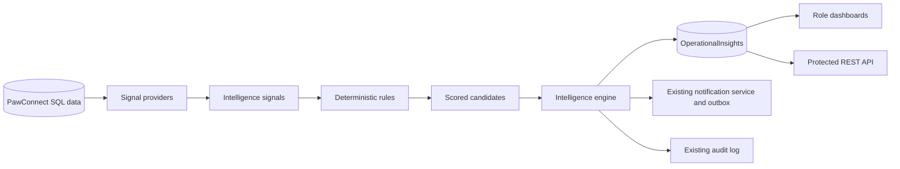

# PawConnect Operations Intelligence Hub

## Purpose

The Operations Intelligence Hub turns existing PawConnect workflow data into deterministic, role-scoped priorities. It answers what needs attention, why it matters, which record is affected, what evidence triggered the insight, and where the user can act.

The feature does not use a paid service or require OpenAI. It does not approve or reject adoption applications and does not rank adopters. It prioritizes operational work and useful adopter next steps.

## Architecture

The implementation is under `Services/Intelligence/`:

- `IIntelligenceSignalProvider` collects factual observations from one module.
- `IIntelligenceRule` converts signals into scored insight candidates.
- `IntelligenceEngine` isolates provider failures, reconciles fingerprints, updates evidence, resolves obsolete insights, and triggers first-detection or severity-escalation notifications.
- `IntelligenceInsightService` provides scoped queries, summaries, acknowledge/snooze/resolve/reopen actions, and rate-limited manual refresh.
- `IntelligenceRecommendationService` validates role, route, entity existence, and shelter/adopter ownership before an action is displayed.

## Implemented Signal Providers

| Provider | Audience | Signals |
| --- | --- | --- |
| Dog operations | Shelter, Admin | Low profile completeness; long availability period without an active application when a reliable availability date exists |
| Adoption review | Shelter, Admin, Adopter | Pending request review delay; multiple pending applications for one dog; confirmed-visit next step |
| Volunteer tasks | Shelter, Admin | Overdue tasks; high/urgent tasks starting soon without an assignee |
| Dog transfers | Shelter, Admin | Urgent pending transfers; delayed pending transfers; approved transfers waiting for completion |
| Notification reliability | Admin | Failed and dead-letter outbox thresholds |
| Adopter next steps | Adopter | New saved-search matches; alert-enabled searches with no current matches |

Foster placement insights are intentionally not implemented because the current PawConnect database has no foster-placement model. Draft-questionnaire and follow-up-request insights are also omitted because the current adoption request status model does not persist those states.

## Scoring and Severity

Each provider supplies named score factors. `StandardIntelligenceRule` sums those factors and caps the score at 100. The UI displays every factor and its point contribution.

| Score | Severity |
| --- | --- |
| 85-100 | Critical |
| 70-84 | High |
| 50-69 | Medium |
| 25-49 | Low |
| 0-24 | Informational |

Thresholds are configured under `IntelligenceHub` in `appsettings.json` and can be overridden through environment variables such as `IntelligenceHub__ApplicationReviewWarningHours`.

## Fingerprints and Lifecycle

Each logical insight has a stable fingerprint containing its audience scope and source key. During refresh:

1. Existing fingerprints are updated instead of duplicated.
2. New conditions create new insights.
3. Conditions that disappear resolve automatically.
4. Resolved conditions reopen if they become relevant again.
5. Severity escalation restores visual prominence and may send one new high-priority notification.

Users can acknowledge an insight without changing the underlying condition. They can snooze normal insights for up to seven days; critical insights can only be snoozed for one hour. Critical technical insights cannot be manually hidden permanently and resolve after the source condition is fixed.

## Role-Based Dashboards

- Shelter: `/shelter/intelligence`
- Admin: `/admin/intelligence`
- Adopter: `/adopter/insights`
- Methodology: `/admin/intelligence/methodology` (Admin and Shelter)

Shelters see only their own dogs, applications, tasks, and transfers. Adopters see only their own saved searches and requests. Admins see platform-level data. Recommended actions are validated against the same scope before rendering.

The dashboard uses a master-detail operations layout. The compact queue is grouped by category and initially focuses on Critical and High priorities. Selecting a row loads its full explanation, evidence, score factors, recommended next step, lifecycle controls, and timeline in a sticky details panel. On tablet and mobile widths, the same details open as a bottom sheet. Acknowledged, snoozed, and resolved work is separated into lifecycle tabs, while saved views and filters remain available in a compact toolbar.

The queue uses a lightweight database projection and does not load every full explanation or score breakdown. Full detail is requested only for the selected, role-scoped insight.

## REST API

Protected endpoints are documented in Swagger:

- `GET /api/v1/intelligence/summary`
- `GET /api/v1/intelligence/insights`
- `GET /api/v1/intelligence/insights/{id}`
- `PATCH /api/v1/intelligence/insights/{id}/acknowledge`
- `PATCH /api/v1/intelligence/insights/{id}/snooze`
- `PATCH /api/v1/intelligence/insights/{id}/resolve`
- `PATCH /api/v1/intelligence/insights/{id}/reopen`
- `POST /api/v1/intelligence/refresh`
- Role aliases: `/api/v1/shelter/intelligence`, `/api/v1/admin/intelligence`, `/api/v1/adopter/insights`

The API returns DTOs rather than EF entities and uses ASP.NET Core Identity role checks plus object-level scoping.

## What-if simulation

Relevant shelter and platform insights expose a **Simulate impact** action. It opens `/shelter/simulator` or `/admin/simulator` with a matching template, such as intake surge, volunteer shortage, transfer, review backlog, profile improvement, or notification failure. The simulator reuses `StandardIntelligenceRule` for score and severity consistency but does not persist projected insights or alter live records. See [SCENARIO_SIMULATOR.md](SCENARIO_SIMULATOR.md).

## Background Refresh and Failure Isolation

`IntelligenceRefreshHostedService` runs at the configured interval. A local semaphore prevents overlapping full evaluations. Each provider is wrapped independently: a failed optional provider is logged and the remaining providers continue. Manual refresh is rate-limited per audience scope.

High-priority notifications use the existing `NotificationService`, which also integrates with notification preferences and the existing email outbox. Duplicate in-app notifications are suppressed within a 24-hour window.

## Privacy and Decision Boundaries

- No external AI provider is used.
- No private questionnaire answers or shelter-only notes are copied into evidence.
- No protected personal characteristic affects scoring.
- Adopter identities are not exposed through aggregate platform intelligence.
- The system recommends review actions; shelter staff retain every adoption decision.

## Adding a Provider

1. Implement `IIntelligenceSignalProvider` in `Services/Intelligence/`.
2. Query only necessary fields with `AsNoTracking`, projections, and role/shelter filters.
3. Return factual evidence, named score factors, a clear resolution condition, and routes that already exist.
4. Register the provider in `Program.cs`.
5. Add focused tests for trigger, non-trigger, scope, score, and lifecycle behavior.

## Troubleshooting

- **Invalid object name `OperationalInsights`:** apply the latest EF Core migration.
- **No insights:** use Refresh Insights, then confirm that source records actually cross configured thresholds.
- **Action unavailable:** the related entity may have been deleted, changed status, or moved outside the user's scope.
- **Background refresh disabled:** set `IntelligenceHub__Enabled=true`.
- **Provider failure:** inspect audit/application logs; other providers should still complete.
