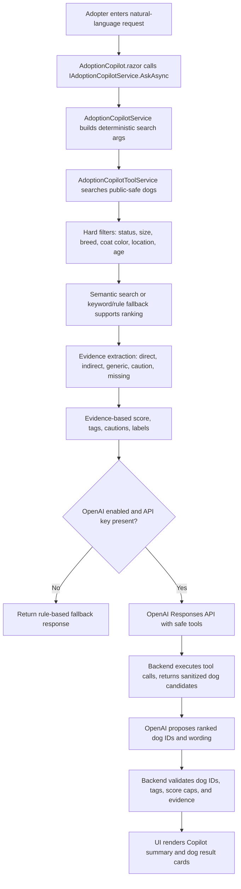

# PawConnect Adoption Copilot Technical Explanation

This document explains how the PawConnect Adoption Copilot works from the user interface down to the OpenAI API integration, backend tools, deterministic fallback, semantic search, evidence extraction, scoring, result validation, and UI display.

It is written as a technical handoff document. It can be used directly for thesis preparation or given to another writing assistant to produce a formal thesis subsection.

## 1. What the Adoption Copilot Does

The Adoption Copilot is an adopter-only feature that lets a user describe the kind of dog they are looking for in natural language.

Route:

```text
/adopter/copilot
```

Main UI component:

```text
Components/Pages/Adopter/AdoptionCopilot.razor
```

Main backend services:

```text
Services/AdoptionCopilotService.cs
Services/AdoptionCopilotToolService.cs
Services/OpenAiAdoptionCopilotClient.cs
Services/SemanticDogSearchService.cs
Services/DogSearchDocumentService.cs
Services/DogSearchEmbeddingService.cs
Services/OpenAiEmbeddingService.cs
```

The Copilot helps with requests such as:

```text
I have a sick dog recovering at home
```

```text
I live in an apartment and want a dog that does not need too much activity.
```

```text
I have a cat at home.
```

```text
black and tan dogs
```

The result is a list of real PawConnect dog cards with:

- a short assistant summary;
- interpreted criteria chips;
- real dog cards from the database;
- score or filter-match label;
- display tags such as `Short walks`, `Calm dog company`, `Coat color: Black and tan`;
- caution tags such as `Reserved - availability may change`, `Ask shelter about cats`, or `Needs more space`;
- favorite and view-details actions.

Important:

The Copilot is advisory. It does not make adoption decisions and does not create adoption requests. The final adoption process still goes through the normal PawConnect adoption request workflow and shelter review.

## 2. High-Level Flow



## 3. UI Entry Point

The adopter page is implemented in:

```text
Components/Pages/Adopter/AdoptionCopilot.razor
```

The page is role-protected:

```razor
@page "/adopter/copilot"
@attribute [Authorize(Roles = "Adopter")]
```

The UI injects the Copilot service:

```razor
@inject IAdoptionCopilotService AdoptionCopilotService
@inject ICopilotStateService CopilotStateService
@inject IDogService DogService
@inject IFavoriteDogService FavoriteDogService
```

When the user clicks `Ask Copilot`, the component calls `AskCopilotAsync`.

Code excerpt:

```csharp
private async Task AskCopilotAsync()
{
    if (string.IsNullOrWhiteSpace(_currentUserId))
    {
        _error = "Current adopter account could not be found.";
        return;
    }

    if (string.IsNullOrWhiteSpace(_query))
    {
        _error = "Describe the kind of dog you are looking for.";
        return;
    }

    _isAsking = true;
    _error = null;

    try
    {
        _response = await AdoptionCopilotService.AskAsync(_currentUserId, _query);
        CopilotStateService.SaveState(_currentUserId, _query, _response);
        await LoadFavoriteStateAsync();
    }
    catch
    {
        _error = "The Adoption Copilot could not load suggestions right now.";
    }
    finally
    {
        _isAsking = false;
    }
}
```

What this means:

- The UI does not query the database directly.
- The UI sends the current adopter ID and the natural-language query to the service layer.
- The response is saved in `CopilotStateService` so returning to the page can restore the latest Copilot result.
- Favorites are reloaded so the result cards can show whether each dog is already saved.

## 4. Main Response DTO

The Copilot returns an `AdoptionCopilotResponse`.

File:

```text
Services/AdoptionCopilotModels.cs
```

Code excerpt:

```csharp
public sealed record AdoptionCopilotResponse(
    string AssistantMessage,
    IReadOnlyList<AdoptionCopilotDogResult> Results,
    bool UsedAiEnhancement,
    bool UsedSemanticSearch,
    bool UsedToolCalling = false,
    string? FallbackReason = null,
    IReadOnlyList<AdoptionCopilotConstraint>? AppliedConstraints = null);
```

Each returned dog is represented by `AdoptionCopilotDogResult`:

```csharp
public sealed record AdoptionCopilotDogResult(
    int DogId,
    Dog Dog,
    int ScorePercent,
    string MatchLabel,
    IReadOnlyList<string> Reasons,
    string SuggestedNextAction,
    double? DistanceKm = null,
    bool UsedAiEnhancement = false,
    IReadOnlyList<AdoptionCopilotConstraint>? MatchedCriteria = null,
    IReadOnlyList<string>? DisplayTags = null,
    IReadOnlyList<string>? CautionTags = null);
```

This DTO is important because it separates:

- the real `Dog` entity used for the card;
- the score and label used for ranking;
- the reasons/tags shown to the adopter;
- whether OpenAI, semantic search, or tool calling was used.

## 5. Service Pipeline

The main service is:

```text
Services/AdoptionCopilotService.cs
```

Interface:

```text
Services/IAdoptionCopilotService.cs
```

The main method is:

```csharp
Task<AdoptionCopilotResponse> AskAsync(
    string adopterUserId,
    string userMessage,
    CancellationToken cancellationToken = default);
```

The important flow inside `AskAsync` is:

1. Trim and validate the query.
2. Build deterministic arguments from the query.
3. Run backend dog search first.
4. Build a fallback response.
5. If OpenAI is disabled or no API key exists, return the fallback.
6. If OpenAI is configured, call the OpenAI client with safe tools.
7. Execute tool calls through PawConnect services.
8. Validate OpenAI dog IDs and tags.
9. Return a safe response to the UI.

Code excerpt:

```csharp
var deterministicArgs = await BuildDeterministicSearchArgsAsync(query, cancellationToken);

var fallbackSearch = await toolService.SearchDogsAsync(
    adopterUserId,
    deterministicArgs,
    cancellationToken);

var fallback = BuildFallbackResponse(
    query,
    fallbackSearch,
    "AI assistance is unavailable right now, so PawConnect used safe rule-based search.");

var settings = openAiOptions.Value;
if (!settings.Enabled || !settings.HasApiKey)
{
    return fallback;
}
```

What this does:

- The application always performs its own safe dog search before depending on OpenAI.
- If OpenAI is missing, disabled, or unavailable, the feature can still return backend-ranked results.
- OpenAI is an enhancement layer, not the source of truth.

## 6. Query Interpretation

The deterministic parser is in:

```text
Services/AdoptionCopilotService.cs
```

Method:

```csharp
private async Task<AdoptionCopilotSearchDogsArgs> BuildDeterministicSearchArgsAsync(...)
```

Code excerpt:

```csharp
var sizes = DetectSizes(query);
var coatColors = DogCoatColorOptions.DetectInText(query);
var statuses = DetectStatuses(query);
var ageConstraint = DetectAgeConstraint(query);
var neighborhood = await DetectExplicitNeighborhoodAsync(query, cancellationToken);
var behaviorTerms = DetectBehaviorTerms(query);
var temperamentTags = DetectTemperamentTags(query);
var homeType = DetectHomeType(query);
var activityLevel = DetectEnergyLevel(query) ?? DetectHouseholdDogActivityLevel(query);
var compatibility = DetectCompatibility(query);
var primaryIntent = DetectPrimaryIntent(query, compatibility, homeType, activityLevel, sizes);
var compatibilityTarget = DetectCompatibilityTarget(compatibility);
```

The result is an `AdoptionCopilotSearchDogsArgs` object.

File:

```text
Services/AdoptionCopilotToolModels.cs
```

It includes fields such as:

```csharp
public sealed class AdoptionCopilotSearchDogsArgs
{
    public string? Query { get; set; }
    public string? PrimaryIntent { get; set; }
    public List<string>? Sizes { get; set; }
    public List<string>? Breeds { get; set; }
    public List<string>? CoatColors { get; set; }
    public string? City { get; set; }
    public string? Neighborhood { get; set; }
    public List<string>? Statuses { get; set; }
    public string? EnergyLevel { get; set; }
    public string? ActivityLevel { get; set; }
    public string? HomeType { get; set; }
    public List<string>? Compatibility { get; set; }
    public string? CompatibilityTarget { get; set; }
    public List<string>? MustHave { get; set; }
    public List<string>? NiceToHave { get; set; }
    public List<string>? Avoid { get; set; }
}
```

Example:

For this query:

```text
I have a sick dog recovering at home
```

The parser should infer:

- `PrimaryIntent = Compatibility`;
- `CompatibilityTarget = SensitiveDog`;
- default public-safe statuses: `Available`, `Reserved`;
- calm/sensitive dog compatibility evidence should matter more than generic friendly wording.

For this query:

```text
black and tan dogs
```

The parser should infer:

- a hard coat-color filter;
- `CoatColors = ["Black and tan"]`;
- the UI should show a filter-style label such as `Exact match` rather than a weak compatibility score.

## 7. Backend Tools and Public-Safe Search

The main internal tool service is:

```text
Services/AdoptionCopilotToolService.cs
```

Main method:

```csharp
public async Task<AdoptionCopilotToolSearchResult> SearchDogsAsync(
    string adopterUserId,
    AdoptionCopilotSearchDogsArgs args,
    CancellationToken cancellationToken = default)
```

This method:

1. normalizes optional arguments;
2. analyzes intent;
3. builds applied constraints for UI chips;
4. loads dogs from EF Core;
5. applies hard filters;
6. retrieves semantic rankings if available;
7. builds scored candidates;
8. returns candidates and applied constraints.

The search loads only public-safe dog statuses:

```csharp
var dogs = await context.Dogs
    .Include(dog => dog.Shelter)
    .Include(dog => dog.DogBreed)
    .Include(dog => dog.SecondaryBreed)
    .Include(dog => dog.Images)
    .AsNoTracking()
    .Where(dog => dog.Status == DogStatus.Available || dog.Status == DogStatus.Reserved)
    .ToListAsync(cancellationToken);
```

This means:

- `Available` dogs can appear.
- `Reserved` dogs can appear with caution.
- `Adopted` dogs are excluded.
- `InTreatment` dogs are excluded.

## 8. Hard Filters

Hard filters are applied before scoring.

Method:

```text
AdoptionCopilotToolService.MatchesHardFilters(...)
```

Code excerpt:

```csharp
if (dog.Status is not (DogStatus.Available or DogStatus.Reserved))
{
    return false;
}

if (statuses.Count > 0 && !statuses.Contains(dog.Status))
{
    return false;
}

if (sizes.Count > 0 && !sizes.Contains(dog.Size))
{
    return false;
}

if (coatColors.Count > 0)
{
    var dogCoatColor = DogCoatColorOptions.Normalize(dog.CoatColor);
    if (string.IsNullOrWhiteSpace(dogCoatColor) || !coatColors.Contains(dogCoatColor))
    {
        return false;
    }
}

if (!string.IsNullOrWhiteSpace(args.Neighborhood) &&
    !string.Equals(dog.Shelter?.Neighborhood, args.Neighborhood.Trim(), StringComparison.OrdinalIgnoreCase))
{
    return false;
}
```

Important distinction:

- Hard filters decide whether a dog is allowed into the candidate set.
- Soft preferences decide score, ranking, tags, and cautions.

Examples of hard filters:

- size;
- breed;
- coat color;
- city/neighborhood;
- shelter name;
- explicit status;
- age constraint;
- radius/nearby search.

Examples of soft preferences:

- calm temperament;
- apartment suitability;
- short walks;
- longer walks;
- cat compatibility;
- child compatibility;
- senior/sensitive dog compatibility.

## 9. Semantic Search and Embeddings

Semantic search is handled by:

```text
Services/SemanticDogSearchService.cs
Services/DogSearchDocumentService.cs
Services/DogSearchEmbeddingService.cs
Services/OpenAiEmbeddingService.cs
Entities/DogSearchEmbedding.cs
```

Purpose:

Semantic search helps PawConnect match meaning, not only exact words.

Example:

```text
quiet apartment dog
```

can match a dog description that says:

```text
settles indoors after short walks
```

even if the exact word `apartment` is not present.

### 9.1 Dog Search Documents

File:

```text
Services/DogSearchDocumentService.cs
```

The search document includes public-safe dog fields:

```csharp
var parts = new List<string>
{
    $"{dog.Name} is a {DogAgeFormatter.Format(dog)} {dog.Size.ToString().ToLowerInvariant()} {DogBreedFormatter.Format(dog)} dog.",
    $"Status: {dog.Status}.",
    $"Location: {dog.Location}."
};
```

It also includes:

- coat color;
- shelter name/city/neighborhood;
- public description;
- behavior description;
- medical summary;
- preferred food type.

It does not include private adopter data, passwords, SMTP credentials, audit logs, or internal notes.

### 9.2 Embedding Storage

Entity:

```text
Entities/DogSearchEmbedding.cs
```

Fields:

```csharp
public class DogSearchEmbedding
{
    public int Id { get; set; }
    public int DogId { get; set; }
    public Dog? Dog { get; set; }
    public string Content { get; set; } = string.Empty;
    public string ContentHash { get; set; } = string.Empty;
    public string EmbeddingJson { get; set; } = string.Empty;
    public string EmbeddingModel { get; set; } = string.Empty;
    public DateTime UpdatedAt { get; set; } = DateTime.UtcNow;
}
```

The `ContentHash` lets the system detect whether the dog search document changed. If the content did not change, the embedding does not need to be regenerated.

### 9.3 OpenAI Embeddings

File:

```text
Services/OpenAiEmbeddingService.cs
```

The service calls:

```text
POST v1/embeddings
```

Code excerpt:

```csharp
using var request = new HttpRequestMessage(HttpMethod.Post, "v1/embeddings");
request.Headers.Authorization = new AuthenticationHeaderValue("Bearer", settings.ApiKey.Trim());
request.Content = JsonContent.Create(new
{
    model = settings.GetSafeEmbeddingModel(),
    input = text
}, options: JsonOptions);
```

Cosine similarity is used to compare embeddings:

```csharp
return dot / (Math.Sqrt(magnitudeA) * Math.Sqrt(magnitudeB));
```

### 9.4 Fallback if Embeddings Are Missing

File:

```text
Services/SemanticDogSearchService.cs
```

The semantic service first tries embeddings if OpenAI is configured:

```csharp
if (settings.Enabled && settings.HasApiKey)
{
    var semanticResults = await TrySemanticSearchAsync(...);
    if (semanticResults.Count > 0)
    {
        return semanticResults;
    }
}

return await KeywordFallbackSearchAsync(...);
```

So if embeddings are not configured, missing, stale, or fail, PawConnect falls back to keyword/rule-based search.

## 10. OpenAI Responses API Integration

The OpenAI client is:

```text
Services/OpenAiAdoptionCopilotClient.cs
```

The app uses OpenAI through the Responses API:

```text
POST v1/responses
```

Code excerpt:

```csharp
using var httpRequest = new HttpRequestMessage(HttpMethod.Post, "v1/responses");
httpRequest.Headers.Authorization = new AuthenticationHeaderValue("Bearer", settings.ApiKey.Trim());
httpRequest.Content = JsonContent.Create(new
{
    model = settings.GetSafeChatModel(),
    input,
    tools = BuildTools(),
    tool_choice = toolChoice,
    parallel_tool_calls = false,
    text = new
    {
        format = BuildResponseFormat()
    }
}, options: JsonOptions);
```

Configuration:

```text
Services/OpenAiSettings.cs
appsettings.json
appsettings.Development.json
Program.cs
```

Settings:

```json
"OpenAI": {
  "Enabled": true,
  "ApiKey": "",
  "Model": "gpt-5.4-mini",
  "ChatModel": "gpt-5.4-mini",
  "EmbeddingModel": "text-embedding-3-small"
}
```

`OpenAiSettings` exposes:

```csharp
public bool Enabled { get; set; }
public string ApiKey { get; set; } = string.Empty;
public string ChatModel { get; set; } = "gpt-5.4-mini";
public string EmbeddingModel { get; set; } = "text-embedding-3-small";
public bool HasApiKey => !string.IsNullOrWhiteSpace(ApiKey);
```

Important:

In the committed configuration, `ApiKey` is empty. The key should be provided through local user secrets, environment variables, or local configuration, not committed to source control.

## 11. OpenAI Tool Calling

OpenAI is not allowed to query SQL directly. Instead, PawConnect exposes controlled tools.

The tools are defined in:

```text
Services/OpenAiAdoptionCopilotClient.cs
```

Method:

```csharp
private static object[] BuildTools()
```

The tools are:

```text
search_dogs
get_adopter_profile_summary
get_favorite_and_recent_preferences
get_dog_details_public
```

### 11.1 search_dogs

Purpose:

Search public-safe PawConnect dogs using structured filters.

Tool description excerpt:

```csharp
description = "Search public-safe PawConnect dogs using structured filters. Returns only real Available or Reserved dogs."
```

The model can pass structured fields such as:

- `sizes`;
- `breeds`;
- `coatColors`;
- `city`;
- `neighborhood`;
- `statuses`;
- `activityLevel`;
- `homeType`;
- `compatibilityTarget`;
- `mustHave`;
- `avoid`;
- `limit`.

### 11.2 get_adopter_profile_summary

Purpose:

Returns a sanitized summary of the current adopter only.

It does not accept a user ID from the model:

```csharp
description = "Get a sanitized summary for the current adopter only. Does not accept a user id."
```

This prevents the model from requesting arbitrary users.

### 11.3 get_favorite_and_recent_preferences

Purpose:

Returns aggregate favorite/recently viewed dog preferences for the current adopter.

It does not expose private dog or adopter records beyond what the feature needs.

### 11.4 get_dog_details_public

Purpose:

Fetches public-safe details for one dog ID.

Description:

```csharp
description = "Fetch public-safe details for one dog ID that was already returned by PawConnect tools."
```

The backend still checks whether the dog is public-safe.

## 12. Tool Execution Is Controlled by PawConnect

OpenAI asks for a tool call, but PawConnect executes it.

File:

```text
Services/AdoptionCopilotService.cs
```

Method:

```csharp
private async Task<CopilotToolExecutionResult> ExecuteToolCallAsync(...)
```

Code excerpt:

```csharp
case "search_dogs":
{
    var args = DeserializeArgs<AdoptionCopilotSearchDogsArgs>(toolCall.ArgumentsJson)
        ?? new AdoptionCopilotSearchDogsArgs();

    MergeDeterministicConstraints(args, deterministicArgs);

    var result = await toolService.SearchDogsAsync(adopterUserId, args, cancellationToken);

    var json = JsonSerializer.Serialize(new AdoptionCopilotToolJsonResult(
        result.Dogs.Count > 0,
        result.EmptyReason,
        result.Dogs.Select(ToDogDto).ToList(),
        result.AppliedConstraints), JsonOptions);

    return new CopilotToolExecutionResult(json, result, null);
}
```

What this means:

- The model can suggest search parameters.
- PawConnect merges those parameters with deterministic constraints already detected by the backend.
- PawConnect runs the real service search.
- PawConnect returns only sanitized DTO data to OpenAI.

## 13. Data Sent to OpenAI

The method `ToDogDto` converts a candidate dog into a safe DTO.

File:

```text
Services/AdoptionCopilotService.cs
```

Code excerpt:

```csharp
return new AdoptionCopilotDogToolDto(
    dog.Id,
    dog.Name,
    DogBreedFormatter.Format(dog),
    EmptyToNull(dog.CoatColor),
    DogAgeFormatter.Format(dog),
    dog.Size.ToString(),
    dog.Status.ToString(),
    EmptyToNull(dog.Description),
    EmptyToNull(dog.BehaviorDescription),
    EmptyToNull(dog.Shelter?.Name),
    EmptyToNull(dog.Shelter?.City),
    EmptyToNull(dog.Shelter?.Neighborhood),
    candidate.DistanceKm,
    ...,
    candidate.SafeReasons,
    candidate.DisplayTags ?? [],
    candidate.CautionTags ?? [],
    candidate.PositiveEvidence ?? [],
    candidate.CautionEvidence ?? [],
    candidate.NegativeEvidence ?? [],
    candidate.MissingEvidence ?? [],
    candidate.EvidenceSummary,
    candidate.ScorePercent,
    candidate.MatchLabel);
```

Public-safe data sent:

- dog ID;
- dog name;
- formatted breed;
- coat color;
- age text;
- size;
- status;
- public description;
- behavior description;
- shelter name;
- shelter city/neighborhood;
- distance if relevant;
- main image URL;
- safe reasons;
- supported display/caution tags;
- evidence items;
- score and match label.

Data intentionally not sent:

- adopter full name;
- adopter email;
- adopter phone;
- adopter exact address;
- password/security fields;
- SMTP settings;
- audit logs;
- private shelter notes;
- raw database access;
- arbitrary user IDs.

## 14. Strict JSON Output

The OpenAI client requires structured JSON output using a JSON schema.

File:

```text
Services/OpenAiAdoptionCopilotClient.cs
```

Method:

```csharp
private static object BuildResponseFormat()
```

The required output shape is:

```json
{
  "assistantMessage": "Nala looks like the strongest fit. Review each profile before sending a request.",
  "results": [
    {
      "dogId": 1,
      "rank": 1,
      "matchLabel": "Good match",
      "scorePercent": 76,
      "displayTags": ["Short walks", "Indoor rest"],
      "cautionTags": [],
      "shortSelectionRationale": "Evidence points to short walks and indoor rest.",
      "reasons": ["Short walks", "Indoor rest"],
      "suggestedNextAction": "View the profile to confirm the energy level and shelter details."
    }
  ]
}
```

The backend still validates the model output after receiving it.

## 15. Preventing Hallucinated Dogs

The most important safety mechanism is that OpenAI can only select dog IDs from PawConnect-provided candidates.

File:

```text
Services/AdoptionCopilotService.cs
```

Code excerpt:

```csharp
var allowedCandidateMap = latestSearchCandidateMap ?? candidateMap;
var aiResults = openAiResponse.Results
    .Where(result => allowedCandidateMap.ContainsKey(result.DogId))
    .OrderBy(result => result.Rank)
    .Select(result => BuildAiResult(result, allowedCandidateMap[result.DogId], appliedConstraints))
    .ToList();
```

If OpenAI returns unknown dog IDs:

```csharp
if (aiResults.Count == 0)
{
    return BuildFallbackFromCandidates(
        query,
        allowedCandidateMap.Values.ToList(),
        usedSemanticSearch,
        true,
        appliedConstraints,
        "OpenAI returned no valid PawConnect dog IDs.",
        latestSearchResult?.EmptyReason);
}
```

This is why the Copilot cannot invent dogs.

The test suite includes a test for this behavior:

```text
PawConnect.Tests/Tests/SemanticDogSearchServiceTests.cs
AdoptionCopilot_IgnoresUnknownOpenAiDogIds
```

## 16. Validating Tags and Reasons

OpenAI is not allowed to invent display tags.

The backend chooses trusted tags:

```text
Services/AdoptionCopilotService.cs
```

Code excerpt:

```csharp
var displayTags = ChooseTrustedTags(aiResult.DisplayTags, searchResult.DisplayTags);
var cautionTags = ChooseTrustedTags(aiResult.CautionTags, searchResult.CautionTags);
```

`ChooseTrustedTags` only keeps tags that are already supported by the backend candidate:

```csharp
var proposed = proposedTags
    .Where(tag => supported.Contains(tag.Trim(), StringComparer.OrdinalIgnoreCase))
    .Select(tag => tag.Trim())
    .Distinct(StringComparer.OrdinalIgnoreCase)
    .ToList();
```

This means:

- the model can choose among supported tags;
- the model cannot add unsupported claims;
- UI tags must be backed by PawConnect evidence.

## 17. Evidence Extraction

Evidence extraction is in:

```text
Services/AdoptionCopilotToolService.cs
```

Method:

```csharp
private static CopilotDogEvidence ExtractDogEvidence(...)
```

The model for evidence is:

```text
Services/AdoptionCopilotToolModels.cs
```

Code excerpt:

```csharp
public sealed record CopilotDogEvidence(
    int DogId,
    IReadOnlyList<string> DirectEvidence,
    IReadOnlyList<string> IndirectEvidence,
    IReadOnlyList<string> GenericEvidence,
    IReadOnlyList<string> PositiveEvidence,
    IReadOnlyList<string> CautionEvidence,
    IReadOnlyList<string> NegativeEvidence,
    IReadOnlyList<string> MissingEvidence,
    IReadOnlyList<EvidenceItem> PositiveEvidenceItems,
    IReadOnlyList<EvidenceItem> CautionEvidenceItems,
    IReadOnlyList<EvidenceItem> NegativeEvidenceItems,
    IReadOnlyList<EvidenceItem> MissingEvidenceItems,
    IReadOnlyList<string> SupportedDisplayTags,
    string EvidenceSummary);
```

Evidence item structure:

```csharp
public sealed record EvidenceItem(
    string Label,
    string Strength,
    string SourceField,
    string? MatchedText);
```

Evidence strengths:

- `Direct`;
- `Indirect`;
- `Generic`;
- `Caution`;
- `Missing`.

Example:

For a sensitive/senior dog query:

- `Calm dog company` is direct evidence.
- `Respectful around dogs` is direct evidence.
- `Not too energetic` is indirect evidence.
- `Friendly` is generic evidence.
- `Ask shelter about sensitive dog fit` is uncertainty.
- `May overwhelm sensitive dogs` is caution.

The extraction code adds tags only when the dog text supports them.

Example excerpt:

```csharp
if (seniorOrSensitiveDogAtHome && HasDogToDogGentlePlayEvidence(searchableText))
{
    AddDisplayTag(displayTags, "Gentle play style");
}

if (seniorOrSensitiveDogAtHome && ContainsAny(searchableText, ["pushy dogs can make", "calm dogs are easier", "pushy playmates"]))
{
    AddDisplayTag(displayTags, "Not suited to pushy dogs");
}

if (seniorOrSensitiveDogAtHome &&
    (HasCalmSignal(searchableText) && !HasActiveSignal(searchableText) ||
    HasCalmDogPreferenceSignal(searchableText)))
{
    AddDisplayTag(displayTags, "Not too energetic");
}
```

## 18. Display Tags Are Filtered by Intent

The Copilot avoids showing unrelated tags.

For example:

- cat queries should show cat-related tags, not apartment tags;
- apartment queries can show `Short walks`, `Indoor rest`, `Settles quickly`;
- sensitive dog queries can show dog-to-dog compatibility tags;
- longer-walk queries should not reward `Short walks` as if it meant `Longer walks`.

This logic is handled in:

```text
AdoptionCopilotToolService.IsDisplayTagRelevantToIntent(...)
AdoptionCopilotConstraintNormalizer.Normalize(...)
```

The constraint normalizer also prevents confusing chip categories.

File:

```text
Services/AdoptionCopilotConstraintNormalizer.cs
```

Example:

```csharp
if (ContainsAny(lower, ["longer walk", "long walk", "active walk", "brisk walk"]))
{
    return ("Activity", "Longer walks");
}

if (label.Equals("Temperament", StringComparison.OrdinalIgnoreCase) &&
    ContainsAny(lower, ["activity", "walk", "exercise", "apartment", "house", "yard", "indoor", "routine"]))
{
    return null;
}
```

This prevents UI chips like:

```text
Temperament: longer walks
```

and keeps the cleaner chip:

```text
Activity: Longer walks
```

## 19. Scoring Logic

The main scoring happens in:

```text
Services/AdoptionCopilotToolService.cs
```

Method:

```csharp
private static AdoptionCopilotToolDogCandidate BuildCandidate(...)
```

The score starts from a conservative base:

```csharp
var score = 34;
```

Then it adds or subtracts points for:

- semantic search support;
- keyword matches;
- availability/reserved warning;
- distance;
- age;
- size;
- coat color;
- lifestyle fit;
- apartment/yard fit;
- city/neighborhood;
- evidence strength;
- cautions and missing evidence.

Example excerpt:

```csharp
if (parsedSizes.Contains(dog.Size))
{
    AddReason(reasons, "Size matches your search");
    score += 11;
}

var parsedCoatColors = ParseCoatColors(args.CoatColors);
var dogCoatColor = DogCoatColorOptions.Normalize(dog.CoatColor);
if (!string.IsNullOrWhiteSpace(dogCoatColor) && parsedCoatColors.Contains(dogCoatColor))
{
    AddReason(reasons, $"Coat color: {dogCoatColor}");
    score += 11;
}

AddLifestyleScores(dog, args, searchableText, reasons, ref score);
```

Evidence is then added:

```csharp
var evidence = ExtractDogEvidence(dog, args, intent, searchableText, safeReasons);
score += CalculateIntentEvidenceScore(intent, evidence, dog.Status);
score = ApplyCompatibilityEvidenceCaps(intent, evidence, score);
score = ApplyHomeActivityEvidenceCaps(intent, evidence, score);
```

Finally, the score is calibrated:

```csharp
var safeScore = filterOnlyRequest
    ? GetFilterOnlyScore(dog.Status, reservedOnlyRequest)
    : CalibrateRecommendationScore(score, intent, evidence);
```

For recommendation-style queries, labels are based on score bands:

```text
80-100  Strong match
65-79   Good match
45-64   Possible match
below 45 Low match
```

Method:

```text
AdoptionCopilotToolService.GetMatchLabel(...)
```

## 20. Filter-Only Queries

Some queries are deterministic filters, not compatibility recommendations.

Example:

```text
black and tan dogs
```

This should not produce a low percentage like `58% Possible match`, because the returned dogs satisfy the explicit filter.

The code detects this:

```csharp
private static bool IsFilterOnlyRequest(AdoptionCopilotSearchDogsArgs args, CopilotIntent intent)
{
    return HasExplicitHardConstraints(args) &&
        (!HasSoftSuitabilitySignals(args, intent) || IsClearlyFilterOnlyQuery(args));
}
```

For filter-only results:

```csharp
var matchLabel = filterOnlyRequest ? "Exact match" : GetMatchLabel(safeScore);
```

The UI hides the percentage for filter labels:

```csharp
@if (!IsFilterMatchLabel(result.MatchLabel))
{
    <span class="match-score-badge">@result.ScorePercent% match</span>
}
```

This separates:

- exact attribute matching;
- lifestyle/compatibility recommendation scoring.

## 21. Score Caps and Cautions

The backend caps scores when the evidence is weak or uncertain.

Example:

```csharp
if (intent.PrimaryIntent == "Compatibility")
{
    if (HasUncertainPrimaryEvidence(evidence))
    {
        score = Math.Min(score, 80);
    }

    if (!HasDirectEvidenceForPrimaryCompatibility(intent, evidence))
    {
        score = evidence.GenericEvidence.Count > 0
            ? Math.Min(score, 70)
            : Math.Min(score, 84);
    }
}
```

Why this matters:

- A dog should not be a `Strong match` for cats if the evidence says `Ask shelter about cats`.
- A dog should not be a `Strong match` for children if there is no child-specific evidence.
- A dog should not be a `Strong match` for a sick/recovering household dog based only on generic words like `friendly`.

## 22. OpenAI Score Safety

Even if OpenAI returns a high score, PawConnect limits it.

File:

```text
Services/AdoptionCopilotService.cs
```

Method:

```csharp
private static AdoptionCopilotDogResult BuildAiResult(...)
```

Code excerpt:

```csharp
var safeScore = Math.Clamp(
    Math.Min(Math.Clamp(aiResult.ScorePercent, 25, 92), searchResult.ScorePercent + 3),
    25,
    92);

if (searchResult.Dog.Status == DogStatus.Reserved)
{
    safeScore = Math.Min(safeScore, 84);
}

if (HasUncertainPrimaryEvidence(searchResult))
{
    safeScore = Math.Min(safeScore, 80);
}
```

This means:

- OpenAI cannot inflate a dog far above the backend score.
- OpenAI output is capped.
- uncertainty tags prevent overconfident results.

## 23. Applied Criteria Chips

The summary chips shown under the Copilot response come from `AppliedConstraints`.

Generated in:

```text
AdoptionCopilotToolService.BuildAppliedConstraints(...)
AdoptionCopilotConstraintNormalizer.Normalize(...)
```

Example:

For:

```text
I live in an apartment but enjoy longer walks
```

Expected chips:

```text
Status: Available, Reserved
Home: Apartment
Activity: Longer walks
Lifestyle: Moderate activity
```

For:

```text
I have a sick dog recovering at home
```

Expected chips:

```text
Status: Available, Reserved
Lifestyle: Calm
Compatibility: Sensitive dog
```

## 24. UI Display

The UI renders the response in:

```text
Components/Pages/Adopter/AdoptionCopilot.razor
```

The response area shows:

- assistant message;
- source chips:
  - `AI-assisted explanation`;
  - `Rule-based fallback`;
  - `Semantic search`;
  - `Used PawConnect data`;
- applied criteria chips;
- dog result cards.

Result card logic:

```razor
@foreach (var result in _response.Results)
{
    var dog = result.Dog;
    var imageUrl = GetDogImageUrl(dog);
    var evidenceDisplays = GetEvidenceDisplays(result.DisplayTags, result.Reasons, matchedLabels);
    var cautionDisplays = GetCautionDisplays(result.CautionTags, dog.Status);
}
```

The UI selects real dog images using:

```csharp
private static string? GetDogImageUrl(Dog dog)
{
    return DogImageUrlValidator.GetPrimaryRealDogImageUrl(dog.Images);
}
```

It also adds a reserved caution if needed:

```csharp
if (status == DogStatus.Reserved &&
    !tags.Contains("Reserved - availability may change", StringComparer.OrdinalIgnoreCase))
{
    tags.Add("Reserved - availability may change");
}
```

## 25. Copilot State Restore

The page state is kept by:

```text
Services/CopilotStateService.cs
```

This stores:

- last query;
- last assistant message;
- applied constraints;
- result dog IDs;
- scores;
- labels;
- tags;
- whether OpenAI/tool/semantic search were used.

When restoring, the UI re-fetches the dog by ID:

```csharp
var dog = await DogService.GetDogDetailsAsync(savedResult.DogId);
if (dog?.Status is not (DogStatus.Available or DogStatus.Reserved))
{
    continue;
}
```

This prevents stale Copilot state from showing dogs that are no longer public-safe.

## 26. Dependency Injection and Configuration

Configured in:

```text
Program.cs
```

Relevant service registrations:

```csharp
builder.Services.AddScoped<IDogSearchDocumentService, DogSearchDocumentService>();
builder.Services.AddScoped<IDogSearchEmbeddingService, DogSearchEmbeddingService>();
builder.Services.AddScoped<ISemanticDogSearchService, SemanticDogSearchService>();
builder.Services.AddScoped<IAdoptionCopilotToolService, AdoptionCopilotToolService>();
builder.Services.AddScoped<IAdoptionCopilotService, AdoptionCopilotService>();
builder.Services.AddScoped<ICopilotStateService, CopilotStateService>();

builder.Services.Configure<OpenAiSettings>(builder.Configuration.GetSection("OpenAI"));
```

HTTP clients:

```csharp
builder.Services.AddHttpClient<IEmbeddingService, OpenAiEmbeddingService>(client =>
{
    client.BaseAddress = new Uri("https://api.openai.com/");
});

builder.Services.AddHttpClient<IOpenAiAdoptionCopilotClient, OpenAiAdoptionCopilotClient>(client =>
{
    client.BaseAddress = new Uri("https://api.openai.com/");
});
```

## 27. Tests That Support the Copilot

Important test file:

```text
PawConnect.Tests/Tests/SemanticDogSearchServiceTests.cs
```

Important test cases include:

```text
AdoptionCopilot_IgnoresUnknownOpenAiDogIds
AdoptionCopilot_OpenAiRequestDoesNotIncludeSensitiveAdopterFields
AdoptionCopilot_BlackAndTanFilterReturnsExactCoatColorMatches
AdoptionCopilot_ApartmentLongerWalksDoesNotRewardShortWalkOnlyDogs
AdoptionCopilot_ApartmentSupportOutranksSpaceOnlyLongerWalkFit
AdoptionCopilot_CatQueryDoesNotShowUnrelatedApartmentTags
AdoptionCopilot_SickRecoveringHouseholdDogUsesSensitiveDogIntent
AdoptionCopilot_OlderResidentDogCompatibilityDoesNotFilterForSeniorCandidateAge
AdoptionCopilot_AskShelterPrimaryEvidenceCannotBeStrongEvenWithOpenAiScore
AdoptionCopilotToolSearch_ReturnsOnlyPublicSafeDogs
AdoptionCopilotToolSearch_FiltersByMediumSizeAndNeighborhood
AdoptionCopilotToolSearch_EmitsStructuredSensitiveDogEvidenceStrengths
```

These tests support claims such as:

- OpenAI cannot inject unknown dog IDs.
- sensitive adopter fields are not sent.
- filter queries behave differently from recommendation queries.
- short walks and longer walks are not treated as the same.
- cat queries do not show apartment tags.
- sick/recovering household dog queries map to `SensitiveDog`.
- public-safe filtering excludes non-adoptable dogs.
- evidence strength is represented structurally.

## 28. Example Flow 1: Sick Dog Recovering at Home

User input:

```text
I have a sick dog recovering at home
```

Expected interpretation:

- primary intent: compatibility;
- compatibility target: sensitive dog;
- lifestyle: calm;
- statuses: available/reserved.

Important code:

```text
AdoptionCopilotService.DetectCompatibility(...)
AdoptionCopilotService.DetectCompatibilityTarget(...)
AdoptionCopilotToolService.ExtractDogEvidence(...)
AdoptionCopilotToolService.ApplyCompatibilityEvidenceCaps(...)
```

Expected output:

- dogs with calm dog-to-dog evidence should rank higher;
- tags such as `Calm dog company`, `Respectful around dogs`, `Gentle play style`, `Not too energetic`;
- caution tags such as `Ask shelter about sensitive dog fit` or `May overwhelm sensitive dogs`;
- dogs without direct dog-to-dog evidence should not be overconfident.

What to say in thesis:

> The Copilot does not simply search for the word "sick". It maps the real-life situation to a compatibility target: the adopter already has a vulnerable dog at home. Therefore direct dog-to-dog calm evidence matters more than generic friendly wording.

## 29. Example Flow 2: Black and Tan Dogs

User input:

```text
black and tan dogs
```

Expected interpretation:

- hard filter: coat color;
- coat color: `Black and tan`;
- no lifestyle compatibility claim.

Important code:

```text
DogCoatColorOptions.DetectInText(...)
AdoptionCopilotToolService.MatchesHardFilters(...)
AdoptionCopilotToolService.IsFilterOnlyRequest(...)
AdoptionCopilotService.BuildFilterAssistantMessage(...)
```

Expected output:

- only dogs whose normalized `CoatColor` matches `Black and tan`;
- label such as `Exact match`;
- no low `Possible match` percentage;
- summary should mention coat color, not status filter.

What to say in thesis:

> The system separates deterministic filters from subjective suitability scoring. If the user asks for a coat color, matching dogs are treated as exact filter results rather than uncertain lifestyle recommendations.

## 30. Example Flow 3: Apartment but Longer Walks

User input:

```text
I live in an apartment but enjoy longer walks
```

Expected interpretation:

- home: apartment;
- activity: longer walks;
- lifestyle: moderate activity;
- do not reward short-walk-only dogs as longer-walk matches.

Important code:

```text
AdoptionCopilotConstraintNormalizer.Normalize(...)
AdoptionCopilotToolService.HasExplicitLongerWalksRequest(...)
AdoptionCopilotToolService.ExtractDogEvidence(...)
AdoptionCopilotToolService.ApplyHomeActivityEvidenceCaps(...)
AdoptionCopilotToolService.ApplyFinalVisibleDifferentiation(...)
```

Expected output:

- dogs with `Longer walks`, `Medium size`, `Settles quickly` should rank above dogs with only `Longer walks` plus `Needs more space`;
- dogs that only prefer short walks can still be apartment candidates, but should not receive a `Longer walks` chip;
- visible tags should explain the score.

What to say in thesis:

> The Copilot distinguishes between inferred assumptions and explicit preferences. Apartment living does not automatically mean low activity if the user explicitly says they enjoy longer walks.

## 31. Limitations

The Copilot is useful, but it has limitations:

- It depends on the quality of shelter-written dog descriptions.
- Evidence extraction is rule-based and may miss unusual wording.
- OpenAI can improve phrasing and interpretation, but backend rules still have to validate results.
- Compatibility is not guaranteed; shelter confirmation is still required.
- Embeddings require OpenAI configuration and a rebuilt dog search index.
- The Copilot is not a replacement for shelter judgment or adoption interviews.

## 32. Strong Thesis Explanation

A good thesis explanation:

> The Adoption Copilot transforms a natural-language adoption need into structured search criteria. PawConnect first applies deterministic parsing and public-safe backend filtering, then extracts evidence from dog descriptions and behavior notes. OpenAI can be used through controlled tool calls, but it never accesses the database directly. It only receives sanitized candidate data returned by PawConnect tools, and the backend validates final dog IDs, tags, and scores before anything is shown. If OpenAI is unavailable, PawConnect still uses rule-based and semantic/keyword fallback search. This makes the feature useful for adopters while keeping the application data and adoption workflow under backend control.

## 33. Short Committee Q&A

### Does the AI access the database directly?

No. The AI can request predefined tools such as `search_dogs`, but PawConnect executes those tools through its own services and EF Core queries.

### Can the AI invent dogs?

No. OpenAI result dog IDs are filtered against the backend candidate map. Unknown IDs are ignored, and if no valid IDs remain, PawConnect returns fallback results.

### What private data is sent to OpenAI?

The Copilot sends public-safe dog candidate data and limited sanitized adopter preference summaries when needed. It does not send passwords, tokens, adopter contact information, SMTP credentials, audit logs, or arbitrary user records.

### What happens without an OpenAI API key?

`AdoptionCopilotService` returns the backend fallback response. Semantic embeddings also require OpenAI, but the semantic search service falls back to keyword/rule-based search.

### Why use OpenAI if the backend already scores dogs?

OpenAI improves natural-language interpretation and explanation style. The backend still performs filtering, evidence extraction, scoring caps, public-safe validation, and final result validation.

### How are scores calculated?

Scores are heuristic. They combine hard constraint matches, soft suitability signals, semantic/keyword support, evidence strength, status cautions, and penalties for missing or negative evidence. They are not a guarantee of real-world compatibility.

### Why show caution tags?

Caution tags make uncertainty visible. For example, `Ask shelter about cats` prevents the UI from presenting an unsupported compatibility claim as a strong match.

### Why is this not just a chatbot?

Because the model cannot freely answer from imagination. It works through PawConnect's backend tools, real dog records, public-safe filters, evidence extraction, and result validation.

