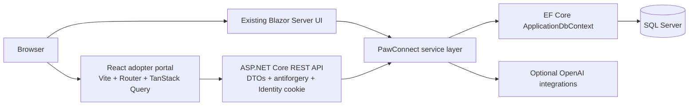

# React Adopter Portal

## Purpose

Card 104 adds a separate React + TypeScript adopter client without replacing PawConnect's Blazor Server UI. It demonstrates that the same application layer can support two presentation technologies while preserving one source of truth for business rules and data.

## Architecture



The React client never reads the database directly. Controllers remain thin and delegate to the same services used by Blazor. This keeps ownership checks, public-safe dog visibility, adoption rules, notification privacy, recommendation behavior, and Copilot candidate validation in the backend.

## Client structure

| Path | Responsibility |
| --- | --- |
| `clients/pawconnect-react/src/api` | Credentialed API client, normalized errors, query keys, and generated OpenAPI types |
| `src/auth` | Current-session query, logout, and adopter route guard |
| `src/components` | Shared UI and dog presentation components |
| `src/features` | Feature-specific hooks and query serialization |
| `src/layouts` | Responsive public/adopter application shell |
| `src/pages` | Route-level screens |
| `src/api/generated/schema.d.ts` | Generated TypeScript contract from Swagger |

## Backend additions

The client reuses existing public and protected APIs. Small adopter endpoints were added only where Blazor previously called services directly:

- `/api/v1/auth/antiforgery`, `/login`, `/me`, `/logout`
- `/api/v1/favorites`
- `/api/v1/adopter/profile`
- `/api/v1/notifications`
- `/api/v1/adoption-copilot/search`

Existing dog, shelter, saved-search, adoption-application, preference, and insight endpoints are reused.

## Security model

1. The login endpoint validates an existing Identity user and requires the `Adopter` role.
2. Successful login issues the same HttpOnly cookie used by PawConnect.
3. The React API client includes credentials but cannot read the cookie from JavaScript.
4. Mutating calls include an antiforgery request token.
5. Backend `[Authorize]`, role checks, service ownership rules, and public-safe DTO mapping remain mandatory.
6. CORS permits credentialed requests only from explicitly configured development origins. Docker uses a same-origin Nginx proxy.

## Routes

| Route | Access | Purpose |
| --- | --- | --- |
| `/` | Public | Real-data landing page |
| `/dogs` | Public | Server-filtered dog discovery |
| `/dogs/:dogId` | Public | Dog details and image gallery |
| `/login` | Public | Adopter sign-in |
| `/favorites` | Adopter | Favorite dogs |
| `/saved-searches` | Adopter | Saved criteria, alerts, and matches |
| `/applications` | Adopter | Application tracking |
| `/applications/:id` | Adopter | Application details and cancellation |
| `/dogs/:dogId/apply` | Adopter | Existing PawConnect adoption questionnaire |
| `/notifications` | Adopter | Notification Center and preferences |
| `/profile` | Adopter | Adopter household profile |
| `/insights` | Adopter | Explainable operational insights |
| `/copilot` | Adopter | Natural-language dog discovery |

## Honest scope boundaries

- The Blazor UI remains the complete multi-role PawConnect application.
- This client intentionally covers only adopter workflows.
- Registration and password recovery continue through the main application; the React client does not duplicate Identity UI.
- No new database tables or EF migration are required.
- OpenAI remains optional. Copilot retains the backend's deterministic fallback and public-safe candidate validation.
- Card 84's dynamic questionnaire and Card 103's journeys were not present on this branch, so no placeholder UI was added for them.

## Verification

The React workspace provides `typecheck`, `lint`, `test:run`, and `build` scripts. `PawConnect.E2ETests/ReactAdopterPortalTests.cs` adds opt-in browser checks for public dog filtering/details, the adopter login/logout lifecycle, and the adopter-only role boundary. These tests use the real local REST API and seeded Identity accounts; they do not require OpenAI.

```powershell
$env:PAWCONNECT_RUN_E2E = "1"
$env:PAWCONNECT_E2E_BASE_URL = "http://localhost:5180"
$env:PAWCONNECT_REACT_E2E_BASE_URL = "http://127.0.0.1:5173"
dotnet test PawConnect.E2ETests\PawConnect.E2ETests.csproj --filter "FullyQualifiedName~ReactAdopterPortalTests"
```

## Screenshot checklist

Capture real local data from these routes rather than adding mocked screenshots:

1. `/` at desktop width, including the dog-photo hero and the first-viewport feature band.
2. `/dogs` with two active filter chips and the first row of dog cards.
3. `/dogs/{id}` using a photographed dog, with the gallery and practical profile information visible.
4. `/favorites` with an adopter signed in.
5. `/saved-searches` with a real saved search and its match preview.
6. `/copilot` after a deterministic, public-safe query has returned varied matches.
7. `/dogs/{id}/apply` on the review step, without submitting a presentation-only request.
8. `/notifications` showing grouped notifications and delivery preferences.
9. `/dogs` at 375 px with the mobile menu and compact filter disclosure visible.

There is intentionally no journey screenshot until Card 103 exposes a real adopter-safe journey API, and no dynamic-questionnaire screenshot until Card 84 is available on this branch.
