# Shelter Capacity and What-If Scenario Simulator

The Scenario Simulator lets Shelter and Admin users test operational assumptions against a read-only snapshot of current PawConnect data. It is deterministic, works without OpenAI or another paid service, and never applies projected changes to dogs, applications, volunteers, transfers, or notifications.

## Routes and roles

| Route | Role | Scope |
| --- | --- | --- |
| `/shelter/simulator` | Shelter | The signed-in shelter only |
| `/admin/simulator` | Admin | One selected shelter or the whole platform |

Both pages use `Components/Shared/SimulationWorkspace.razor`. Every view displays: **Simulation only — no real PawConnect data will be changed.**

## Data flow

```mermaid
flowchart LR
    UI["Simulator UI"] --> Service["ShelterSimulationService"]
    Service --> Snapshot["Read-only scoped baseline"]
    Snapshot --> Engine["SimulationEngine"]
    Engine --> Appliers["Modular assumption appliers"]
    Appliers --> Projected["Isolated projected state"]
    Projected --> Rules["Existing StandardIntelligenceRule"]
    Rules --> Result["Risk changes, scorecard, timeline, recommendations"]
    Result --> UI
    Result -. "only after explicit Save" .-> History[("Scenario and run snapshots")]
```



`ShelterSimulationService` uses EF Core projections and `AsNoTracking`-style read queries through `IDbContextFactory<ApplicationDbContext>`. The engine receives DTO snapshots, not tracked operational entities. Assumption appliers return new immutable `SimulationStateDto` records. The only simulator writes are `ShelterSimulationScenario` and `ShelterSimulationRun` records after the user explicitly saves or reruns a saved scenario.

## Baseline inputs

The baseline is built from real, scoped PawConnect modules:

- active shelter dogs (`Available`, `Reserved`, and `InTreatment`)
- configured `Shelter.DogCapacity` and `ReservedEmergencySpaces`
- active volunteer profiles
- open and overdue volunteer tasks
- pending adoption requests
- dog profiles missing important public information
- pending incoming and outgoing transfers
- failed or dead-letter notification outbox records

Admins can aggregate these values across shelters. Shelter users can load only the shelter linked to their Identity account.

PawConnect currently has no foster-placement domain model. The simulator therefore does not include foster-ending assumptions or claim to project foster capacity.

## Supported assumptions

- additional dog intake
- volunteers becoming unavailable or being added
- incoming or outgoing dog transfers
- applications being reviewed or newly submitted
- dog profile improvement work
- notification failures being added or cleared
- temporary capacity added or made unavailable

Each assumption has a quantity and effective day. Horizons are limited to 1-90 days; the UI offers 7, 14, and 30 day presets.

## Deterministic workload score

`SimulationScoring.Workload` calculates:

```text
dogs * 2
+ special-needs dogs * 3
+ open tasks * 2
+ overdue tasks * 5
+ pending applications * 2
+ incoming transfers * 3
+ incomplete profiles
+ failed notifications * 2
- active volunteers * 4
```

The value is clamped to `0-100` and labeled:

- `0-39`: Normal
- `40-59`: Elevated
- `60-79`: High
- `80-100`: Critical

This is an explainable planning indicator, not a prediction of shelter outcomes.

## Risk evaluation

`SimulationImpactAnalyzer` creates simulation-only `IntelligenceSignal` objects for:

- capacity pressure
- overall workload
- adoption application backlog
- volunteer coverage
- dog profile quality
- notification reliability
- transfer readiness

It passes these signals to the existing `StandardIntelligenceRule`. Therefore the simulator reuses the Operations Intelligence score and severity bands instead of maintaining a second hidden scoring system. No simulated `OperationalInsight` is persisted.

Baseline and projected risks are matched by stable keys. A change is classified as new, escalated, stable, reduced, or resolved. A score movement of at least 10 points is considered a material escalation or reduction.

## Saved scenarios and runs

`ShelterSimulationScenario` stores the reusable name, scope, horizon, and assumptions. `ShelterSimulationRun` stores JSON snapshots of the baseline, assumptions, result, risk delta, capacity delta, and recommendations. The run also records engine version and duration.

Saved scenarios can be pinned, rerun against the current baseline, deleted, and compared. Rerunning intentionally uses current operational data with the saved assumptions; the previous run snapshot remains historical evidence.

## Authorization

Authorization is enforced in both UI routes and `ShelterSimulationService`:

- Shelter users can run, save, list, rerun, compare, and delete only scenarios for their own shelter.
- Admin users can use one-shelter or platform scope and inspect all saved scenarios.
- Adopters and public users cannot access simulator pages or API endpoints.
- Object-level checks are repeated in the service; hiding a UI link is not considered authorization.

## API

Protected Swagger endpoints are under `/api/v1/simulations`:

- `GET /templates`
- `GET /scenarios`
- `GET /scenarios/{id}`
- `POST /run`
- `POST /save-and-run`
- `POST /scenarios/{id}/rerun`
- `GET /compare?firstScenarioId=...&secondScenarioId=...`
- `DELETE /scenarios/{id}`

The API uses DTOs and the same service-level scoping as the Blazor UI.

## Extension points

Add a new assumption by:

1. Adding an enum value to `SimulationAssumptionType`.
2. Implementing or extending an `ISimulationAssumptionApplier`.
3. Registering the applier in `Program.cs`.
4. Adding its label/template to the UI when appropriate.
5. Adding focused tests for state changes and isolation.

New risk dimensions should create evidence-based `IntelligenceSignal` values and continue through `IIntelligenceRule`, preserving one explainable severity model.
