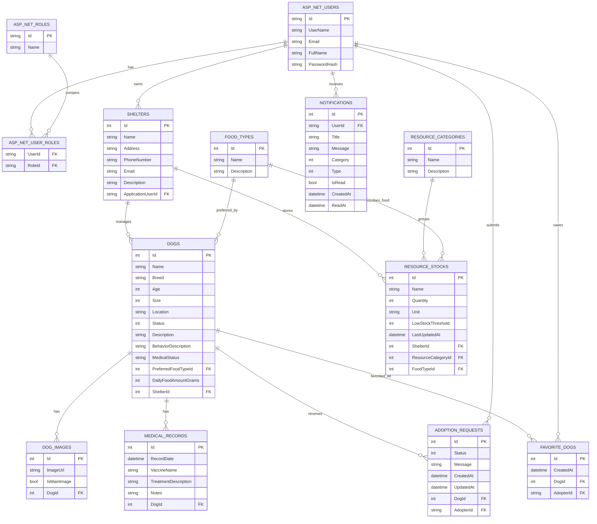

# PawConnect Database Diagram

This diagram shows the main PawConnect domain tables and how they relate to ASP.NET Core Identity users.

## Relationship Summary

- One user can have many roles through `AspNetUserRoles`.
- One shelter can manage many dogs.
- One shelter can store many resource stock records.
- One resource category can group many resource stock records.
- One food type can be used by many food stock records.
- One food type can be selected as the preferred food type for many dogs.
- One dog can have many images.
- One dog can have many medical records.
- One dog can receive many adoption requests.
- One adopter user can submit many adoption requests.
- Favorite dogs are stored through `FavoriteDogs`, which connects users and dogs.
- `FavoriteDogs` has a unique rule for `AdopterId + DogId`, so a user cannot favorite the same dog twice.
- In-app notifications are stored in `Notifications` and belong to one Identity user.
